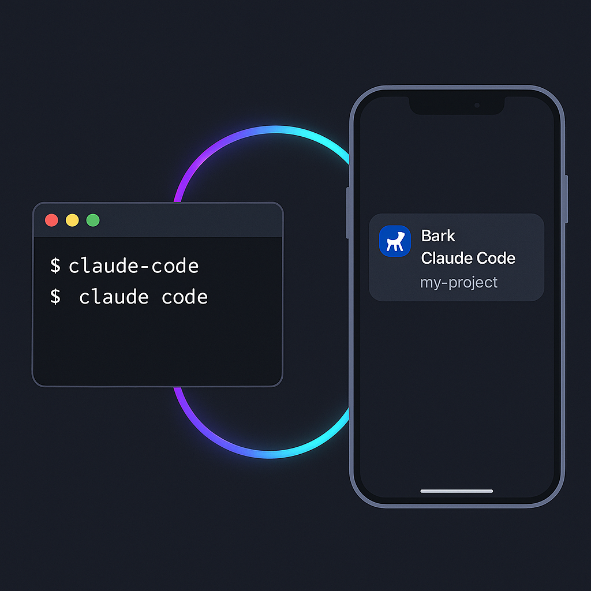

# claude-bark-notify



A Claude Code [Notification hook](https://docs.anthropic.com/en/docs/claude-code/hooks) that pushes mobile alerts via [Bark](https://bark.day.app) whenever Claude needs your attention.

**What you get on your phone:**
- **Title** — `Claude Code · <project name>` (so you know which session is calling)
- **Body** — the last thing Claude actually said, not a generic "Task completed"

## Requirements

- [Bark](https://bark.day.app) installed on your iPhone
- `jq` and `curl` available in your shell (`brew install jq`)

## Install

```bash
BARK_KEY=your_bark_key bash install.sh
```

Your Bark key is visible in the Bark app (tap the key icon on the main screen).

The installer:
1. Copies `bark-notify.sh` to `~/.claude/scripts/` with your key baked in
2. Injects the Notification hook into `~/.claude/settings.json` (backs up first)

Reload Claude Code for the hook to take effect.

## Manual setup

If you prefer to wire it up yourself, add to `~/.claude/settings.json`:

```json
{
  "hooks": {
    "Notification": [
      {
        "matcher": "",
        "hooks": [
          {
            "type": "command",
            "command": "/Users/you/.claude/scripts/bark-notify.sh"
          }
        ]
      }
    ]
  }
}
```

And set `BARK_KEY` in the script (or export it in your shell environment).

## Configuration

Edit `bark-notify.sh` directly — the top of the file has all the knobs:

| Variable | Default | Description |
|---|---|---|
| `BARK_KEY` | *(required)* | Your Bark device key |
| `BARK_HOST` | `https://api.day.app` | Bark server URL (self-hosted supported) |
| `BARK_ICON` | Claude favicon | Notification icon URL |
| `BARK_MAX_BODY` | `200` | Max characters of assistant text to include |

## How it works

Claude Code fires the `Notification` hook whenever it needs your attention (permission requests, idle waiting, task complete). The hook receives a JSON payload on stdin containing the session's `transcript_path`. The script tails the transcript for the most recent assistant message and pushes it as the notification body — so you see actual context instead of a generic string.

## License

MIT
